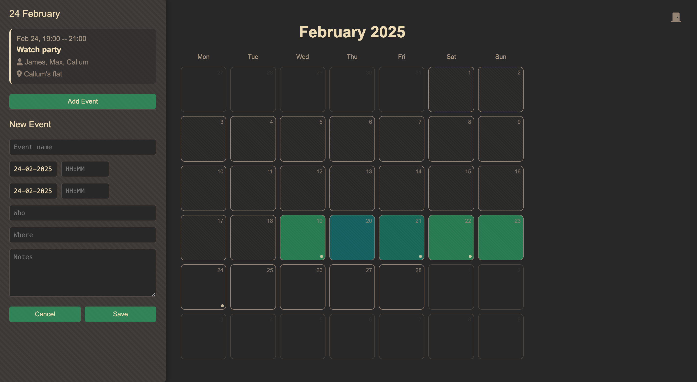

# Personal Calendar & Mood Tracker



## Features

- **Interactive Calendar Interface**
  - Monthly view with intuitive navigation
  - Keyboard shortcuts for navigation (h/l keys)

- **Event Management**
  - Create, edit, and delete events
  - Add location, attendees, and notes to events
  - Daily mood logging with color coding

## Development Setup (uv)

1. Install [`uv`](https://docs.astral.sh/uv/).
2. Create the project environment and install dependencies:

```bash
uv sync
```

3. Run the app:

```bash
uv run flask --app app.py run
```

4. Run linting:

```bash
uv run ruff check .
```